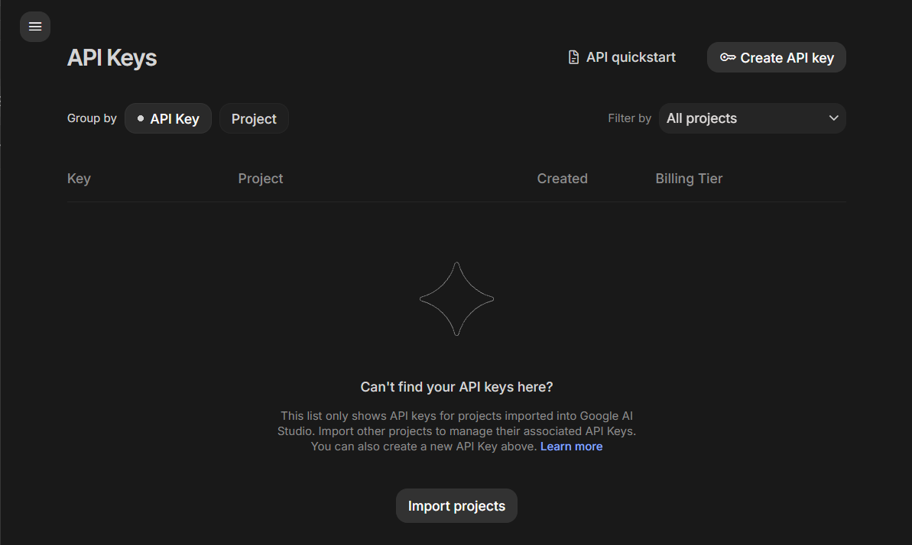
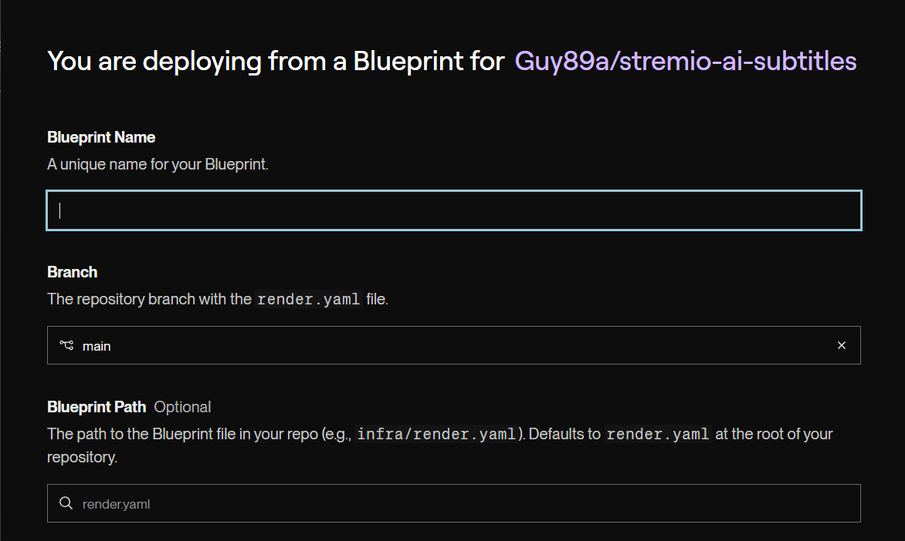
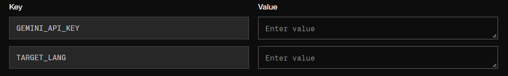
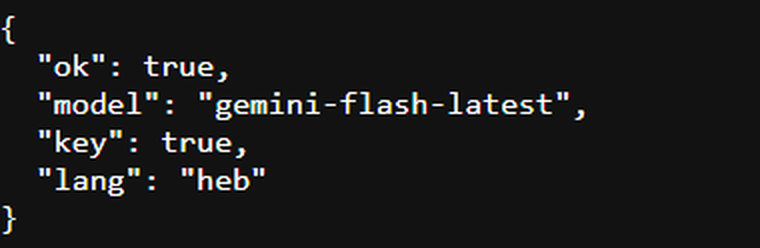
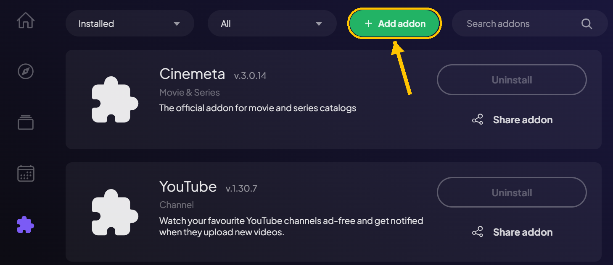
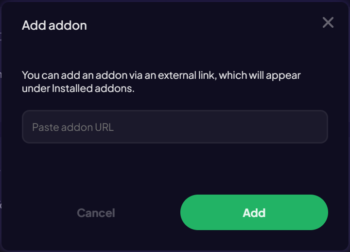
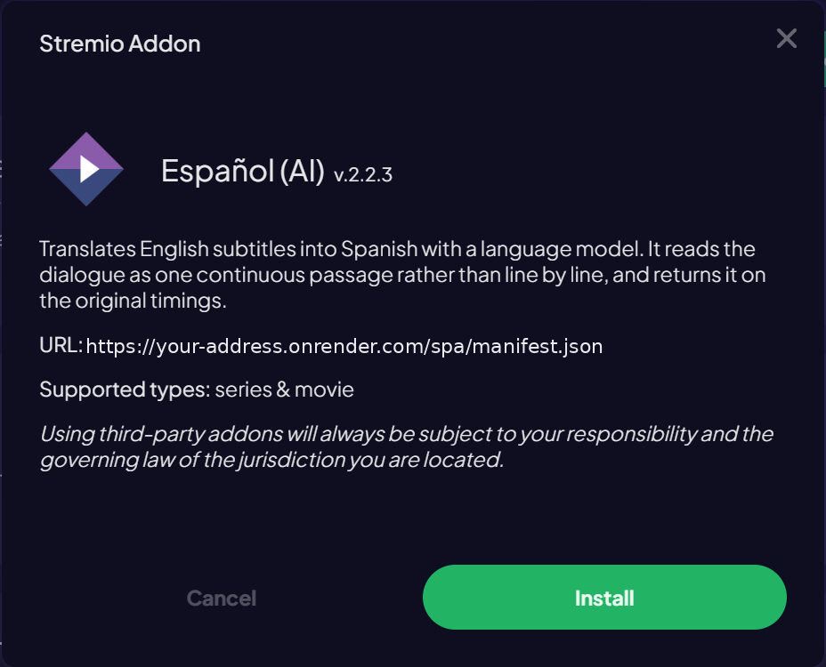
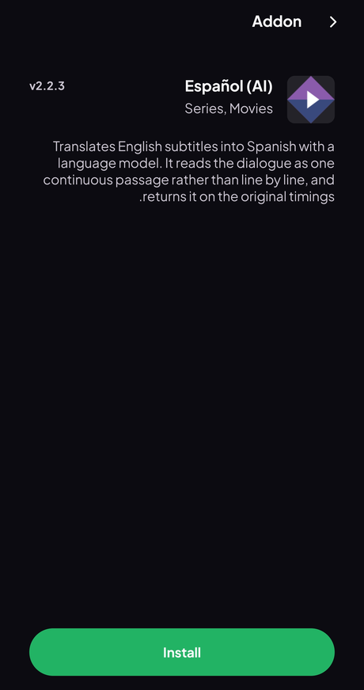
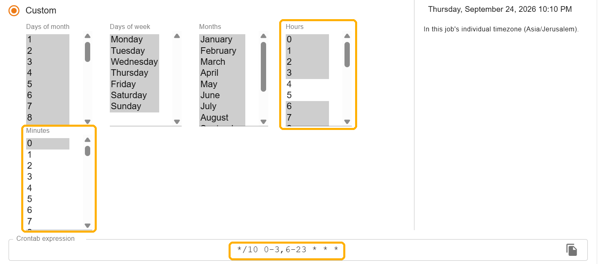

# Setup guide

This is the long version of the install steps, with the problems people actually hit.
If you just want the short version, see the [README](README.md).

Takes about ten minutes. Everything is free. You do not need to know how to code.

---

## What you need

Two free accounts. Neither asks for a credit card.

- **Google AI Studio** — gives you the translation key
- **Render** — runs the server in the cloud

You do not need to leave a computer on, and there is nothing to download. After setup
everything runs in the cloud. Every device in the house connects to it directly: phone,
TV, computer.

---

## Step 1 — Get a Gemini key

Go to [aistudio.google.com/apikey](https://aistudio.google.com/apikey). Sign in with a
Google account and press **Create API key**. The default settings are fine.



Copy the key somewhere temporary. You need it in the next step.

The key looks like `AQ.xxxxx…` or `AIzaSy…`. Both are valid.

---

## Step 2 — Deploy to Render

Press this button:

[](https://render.com/deploy?repo=https://github.com/Guy89a/stremio-ai-subtitles)

If the button does not work, the full address is:

```
https://render.com/deploy?repo=https://github.com/Guy89a/stremio-ai-subtitles
```

If you do not have a Render account you will be asked to sign up. It is free and takes a
minute. After that the button brings you back to the same screen.

Three fields appear at the top:

- **Blueprint Name** — **this field is empty and you must fill it in.** Any name works,
  for example `ai-subs`.
- **Branch** — already says `main`. Leave it.
- **Blueprint Path** — leave it as it is. The grey `render.yaml` is just a hint.



Scroll down. Two fields matter:

- `GEMINI_API_KEY` — **paste the key from step 1 here.**
- `TARGET_LANG` — the language you want. Use a code from the
  [table in the README](README.md#languages), for example `spa` for Spanish. Leave it
  empty for Hebrew. You can use other languages later without deploying again.



Press **Deploy Blueprint**. The build takes a minute or two.

> If you are asked to choose between "Associate existing services" and "Create all as new
> services", this only happens if you have deployed this addon before. Choose
> **Create all as new services**.

A variable called `SECRET` is created automatically and is not shown. Do not change it
later — it is what encrypts keys into install addresses.

---

## Step 3 — Check that the server is alive

When the deploy finishes you get an address like
`https://ai-subs-xxxx.onrender.com`. It is at the top of the service page, under the name.

Open that address in a browser with `/health` at the end:

```
https://your-address.onrender.com/health
```

You should get back something like this:



**`"key":true` is the important part.** It confirms the key was picked up. If it says
`false`, open the service page on Render, go to the **Environment** tab, and check
`GEMINI_API_KEY`.

---

## Step 4 — Install in Stremio

The install address is your address, plus the language code, plus `/manifest.json`:

```
https://your-address.onrender.com/heb/manifest.json     Hebrew
https://your-address.onrender.com/spa/manifest.json     Spanish
https://your-address.onrender.com/jpn/manifest.json     Japanese
```

**On a computer** — in the Stremio app, open **Addons** and press **+ Add addon**:



Paste the address into the field and press **Add**:



A window with the addon's name and description opens. Press **Install**:



Pasting the address into the search box does not work in the desktop app. Use **Add addon**.

**On a phone** — there is no Add addon button. Open **Addons**, paste the address into the
search field, and the addon page opens. Press **Install**:



If you install it on one device, it syncs to every device signed in to the same Stremio
account, including the TV.

You can install several languages at the same time. Each one is a separate addon.

Open an episode, wait about a minute the first time, and pick the language in the subtitle
menu.

---

## Step 5 — Keep the server awake (optional)

On Render's free plan the service sleeps after 15 minutes without activity. Waking up
takes 30 to 60 seconds. You can avoid that by calling the address every few minutes.

Sign up at [cron-job.org](https://cron-job.org) → **Create cronjob**:

- **URL:** `https://your-address.onrender.com/health`
- **Schedule:** choose *Custom*, and in the minutes column select `0,10,20,30,40,50`.
  That is one ping every 10 minutes.
- **Hours:** select all of them **except 4 and 5**.



The Crontab line at the bottom should read:

```
*/10 0-3,6-23 * * *
```

**Why not 24 hours a day.** The free plan gives 750 hours a month. A long month is 744
hours, so the margin is only six hours. If you go over, the service stops until the next
month. Skipping two hours at night brings it to about 680 hours. That is a safe margin and
you will not notice the difference.

Also check that the time zone in your cron-job.org account settings is your own, or the
two skipped hours will land in the middle of the evening.

---

## How long it takes

A first episode usually takes **about a minute**. A real measurement: 709 lines in eight
chunks, 51 seconds from the start of the download to a finished file.

Sometimes it takes a few minutes. Google limits the request rate (error 429) or the model
is busy (503). The addon waits and tries again by itself. You can watch it in the log.
This is normal and needs nothing from you.

---

## Why some lines stay in English

Google's content filters have a level that cannot be turned off in settings, and drama
dialogue sometimes triggers it. When that happens the addon splits the chunk in two and
tries again, over and over, until only the lines that really trigger it are left. In
practice this is a few lines in a whole episode. They are shown in English instead of
disappearing.

---

## Updates

Render watches the code. When a new version comes out it usually deploys by itself.
To do it now: on the service page → **Manual Deploy** → **Deploy latest commit**.

Stremio remembers the addon details from when you installed it. If an update changed what
the addon reports about itself, remove it and install it again with the same address. It
takes two seconds and deletes nothing.

Note that deploying clears the cache, because the free plan has no permanent disk. The
first episode after an update is translated again.

---

## When something does not work

Several answers below mention the log. To see it, open your service on Render and choose
**Logs** in the left menu. The newest lines are at the bottom.

### The language is not in the subtitle menu

Check `/health` first. If it does not answer, the service is asleep or has crashed — open
the service page on Render and look at the log. If it answers and says `"key":false`, the
key is not set.

### The log shows 429 or 503

That is Google, not you. 429 is the per-minute request limit. 503 means the model is busy.

For 429, the addon waits and tries again. For 503, it tries twice, then moves to the backup
model and stays there for five minutes. The log says `overloaded` when that happens. There
is nothing to do except wait.

### The log says "daily quota used up"

The main model, Flash, has a smaller free daily quota than Flash-Lite. When it runs out the
addon switches to Flash-Lite by itself and keeps translating. Nothing to do. Flash comes
back once Google resets the quota.

### The log shows 404 on the model

Google retired the model. This happens from time to time. On the service page on Render,
in the **Environment** tab, delete the values of `GEMINI_MODEL` and `GEMINI_FALLBACK` and
enter a current model from the list at
[AI Studio](https://aistudio.google.com).

### The episode is translated again every time

The free plan has no permanent disk, so the cache is cleared when the service sleeps or
restarts. The ping in step 5 keeps it through the evening, which is the case that matters.

### A name is translated as an ordinary word

This is what the names pass is for. Before translating, the addon collects the proper
names in the episode and asks once how to write each one, so "Billy the Kid" is treated as
a single name instead of a name plus a word. It is on by default. If you ever want it off,
set `NAME_GLOSSARY` to `0`.

### Two identical languages in the subtitle menu

The addon translates two different English sources per episode, so you have a second
option if the first has bad timing. If you would rather have one, set `MAX_SOURCES` to `1`
in the **Environment** tab. This also halves how much quota each episode uses.

---

## Settings you can change

On the service page on Render, under **Environment**. Changing one redeploys automatically.

| Field | Default | What it does |
|---|---|---|
| `TARGET_LANG` | `heb` | Default language. Any code from the table |
| `CHUNK_SIZE` | `80` | Lines per request. Larger gives better context, but is blocked more often |
| `MIN_SPLIT` | `2` | How far to keep splitting a blocked chunk. Lower leaves less English, but is slower |
| `CONCURRENCY` | `1` | Requests at the same time. Do not raise it. This is what uses up the per-minute quota |
| `MAX_SOURCES` | `2` | English sources per episode. `1` halves quota use |
| `REFERENCE_LANG` | empty | A second track in a language that marks gender, for example `spa`. Improves gender, adds about a third to the time |
| `KEEP_SOUND_CUES` | empty | `1` to keep sound descriptions instead of removing them |
| `NAME_GLOSSARY` | `1` | Decides every recurring name once, before translating, so they stay consistent. `0` turns it off |
| `RATE_LIMIT_PER_DAY` | `40` | New episodes per day per caller |
| `RATE_LIMIT_TOTAL` | `200` | Daily limit for the whole service. This is what protects your quota |
| `MAX_JOBS` | `3` | Translations running at once |

An episode that is already translated and cached does not count against these limits, so
watching something again is never blocked.

---

## Other ways to run it

### On your own computer instead of the cloud

If you would rather not use cloud accounts, download the code from GitHub
(**Code** → **Download ZIP**) and use the local path. Double-click `INSTALL.bat` to run a
wizard that installs what is needed, then `START.bat` to start the service. The trade-off
is that the computer has to stay on while you watch, and two windows have to stay open.

> On the local path, **do not select text with the mouse inside those windows.** Windows
> freezes a process that is in text-selection mode, and this stops the translation in the
> middle with no error message. If it happens, press **Esc** to release it.

### Sharing the server with other people

If you leave `GEMINI_API_KEY` empty in step 2, the server switches to public mode. Anyone
can open the main address, choose a language, paste their own key, and get a personal
install address with their key encrypted inside it. This is useful for letting someone try
it without deploying anything.

Note that in this mode the server decrypts the key at request time, so users are trusting
whoever runs it. Anyone who wants full isolation should just follow this guide on their own
account.

---

## Checking it yourself

If you have Node.js installed locally you can run this at any time, without the network
and without using any quota:

```bash
npm test
```

It checks that timings, line numbering, text direction, language separation and the
security rules all survive the whole pipeline.

---

## A few things worth knowing

- Your API key is stored only in your own server's settings. It appears in no address, is
  never written to the log, and does not sync to any device.
- If you think the key has been exposed, delete it in AI Studio, create a new one, and
  update `GEMINI_API_KEY` on Render. It is free and takes a minute.
- The English subtitles come from the public OpenSubtitles addon, the same one Stremio
  comes with. This addon does not host or share any subtitles of its own.

---

Built for personal use. No central server, no sign-up, no payment — just two free accounts.
Open source under AGPL-3.0.
